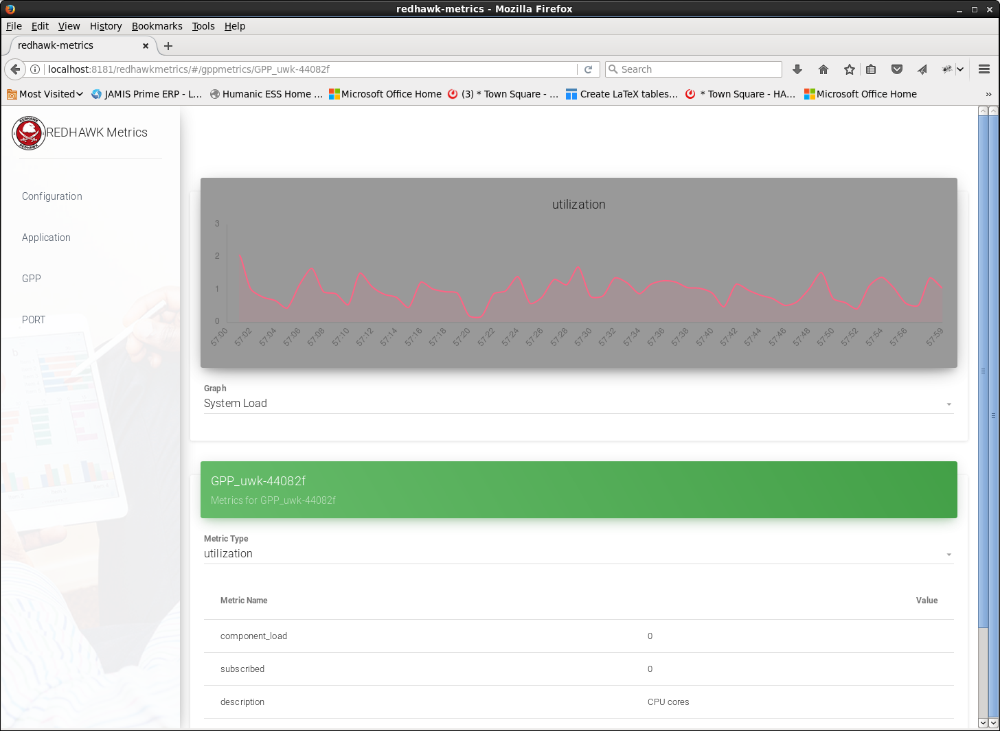

== REDHAWK Metrics

The metric-related REST endpoints provide the option to RESTFully get the following metrics: 

* BulkIO Port Statistics 
* GPP Metrics
** component_monitor: Metrics related to each component controlled by the GPP
** utilization
** sys_limits
** nic_metrics
* Application Metrics

For more information about BulkIO Port statistics, GPP metrics, or Application metrics, refer to the REDHAWK Manual.

By combining the REST Endpoints, which produce JSON with a data flow framework (for example: Apache Camel, Apache NiFi), metrics can be retrieved from a REDHAWK Domain and put in a desired metrics solution. The following example provides a Camel route for getting metrics from a Domain at a specific interval:

[source, xml, indent=0]
----
include::camel/route.xml[]
----

The data flow framework provides components for you to use for `Persistence`, such as https://www.elastic.co/products/elasticsearch[Elastic Search] and https://www.mongodb.com/[MongoDB]. Once the data is stored in a `Persistence` backend, Dashboard GUI utilities, such as https://www.elastic.co/products/kibana[Kibana] and https://grafana.com/[Grafana], may be used to customize dashboards and write flexible queries against, which provides details about the domain. 

=== REDHAWK Metrics Demo Webapp

To view metrics from the past and have the option to set up queries, use the techniques described in <<REDHAWK Metrics>>. To view a simple snapshot of a Domain's metrics, use the demo metrics web application supplied in the `redhawk-demo-dist`.

If you performed a group install, `REDHAWK Enterprise Integration`, the demo metrics web application was installed then. Otherwise, you need to install the `redhawk-demo-dist` on your system before performing the following steps to launch the application on your karaf instance.

. Copy `demo/redhawk-metrics/redhawk-metrics-webapp-{version}.jar` into the deploy directory of Karaf(${karaf.base}/deploy).
. Open the browser to http://{hostname}:{karaf.port}/redhawkmetrics.
. Click the `GPP`, `Application`, `PORT` links to visualize each type of metric.
. Click `Configuration` to configure the REST endpoints the webapplication should be using. 

Screenshot:

