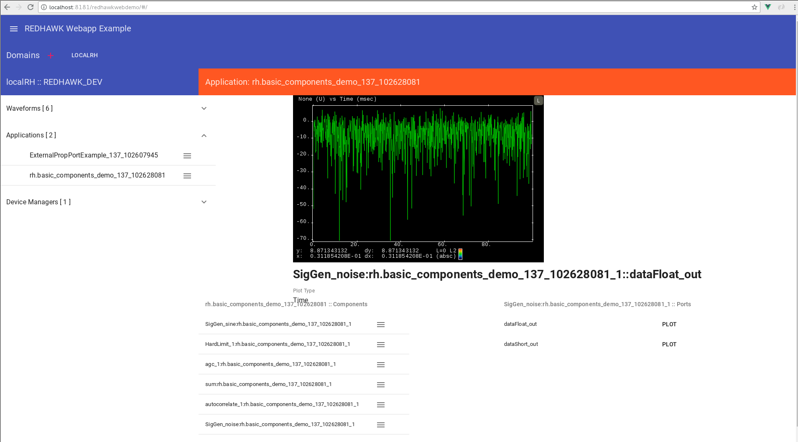

== REDHAWK Demo Webapp

The REDHAWK Demo Webapp is an example web application that enables users to interact with a REDHAWK Domain via the web. The web application uses REDHAWK REST, REDHAWK WebSocket, and REDHAWK Driver. The jetty running in the Karaf Container serves as the web server. 

=== Instructions

To use this application, copy `redhawk-demo-webapp.jar` into the `$karaf.base/deploy` directory, which deploys the web application into Karaf. After the application is deployed, you can view the path of the webapp by entering the following command:

	web:list
	

Example output:

	karaf@root()> web:list
	ID  | State       | Web-State   | Level | Web-ContextPath | Name
	------------------------------------------------------------------------------------------------------
	158 | Active      | Deployed    | 80    | /redhawkwebdemo | REDHAWK :: DEMO :: WEBAPP (2.0.4.SNAPSHOT)

View the web application at: 
----
http://{hostname}:8181/redhawkwebdemo  #hostname is the hostname of the server with your karaf instance
----

After opening the web application, to add a Domain, click the '+' button. Enter the information, and then click the 'view' button on the Domain you added. You have access to command and control your configured Domain from the web. 

Screenshot:

