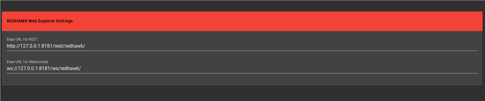
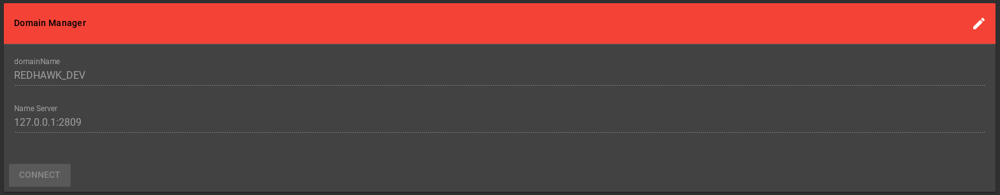
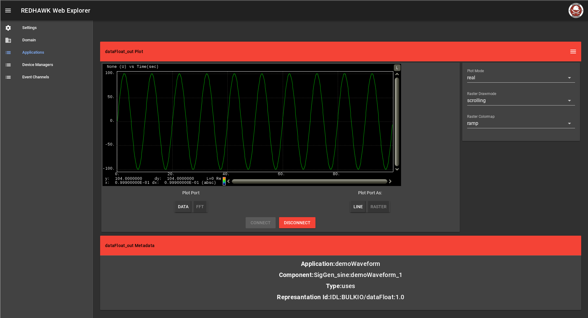
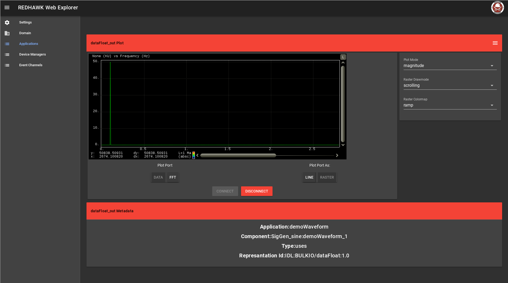
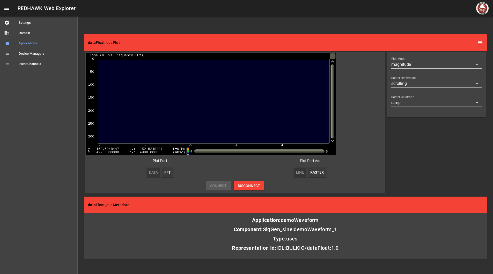

== REDHAWK Web Explorer Demo

The REDHAWK Web Explorer demo webapp is an example web application that enables users to interact with a REDHAWK Domain via the web. The web application serves
as an example use case for <<REDHAWK REST>>, <<REDHAWK WebSocket>>, and <<REDHAWK Driver>>.

=== Installation Instructions

==== Jetty

. To use this application copy `redhawkwebexplorer.war` into the `${jetty.home}/webapps` directory
. Now you can view the application at http:{hostname}:8181/redhawkwebexplorer

==== Karaf

. To use this application copy `redhawkwebexplorer.war` into the `${karaf.base}/deploy` directory
. Now you can view the application at http:{hostname}:8181/redhawkwebexplorer

=== Usage Instructions

. Update the REST and Websocket settings to point to the appropriate URLs for your system. By default
the urls are pointed at localhost.
+

+
. Click on Domain in the side bar and configure the Domain Name(default REDHAWK_DEV) and Name Server(127.0.0.1:2809) locations and
click `Connect`.
+

+
. With the above configured you'll now be able to interact with the Domain and Applications, Devices, and Event Channels it manages.

Below are additional screen shots:

