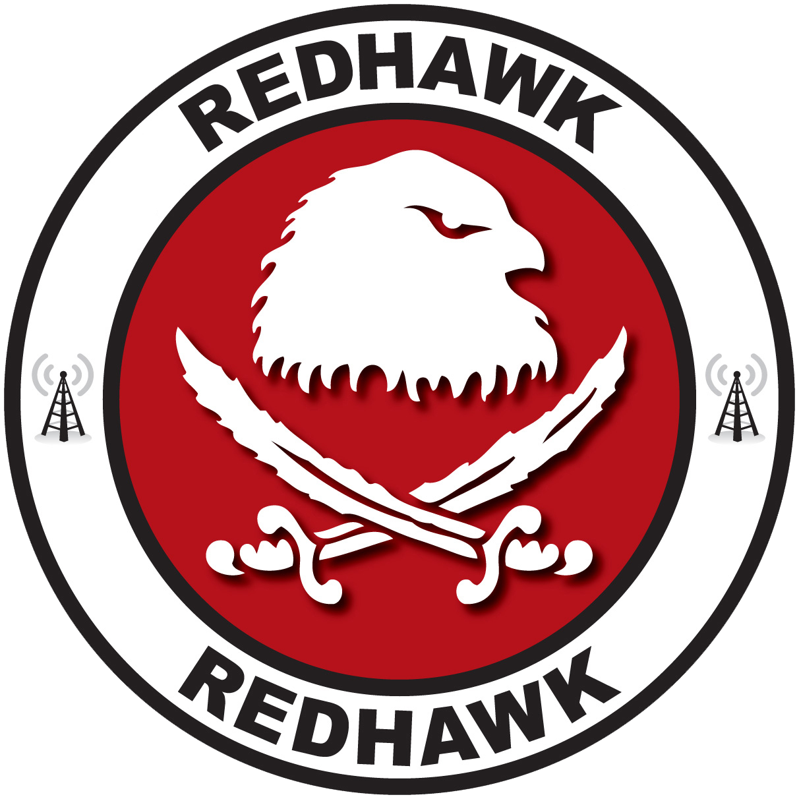

= REDHAWK Enterprise Integration User Guide
{project-version}
{timestamp}
//image::RedHawk_Logo.png[scaledwidth=30%]

//ifndef::imagesdir{:imagesdir: images]

:title-logo-image: 

//:docinfo: docinfo  

include::introduction.adoc[]

include::installation.adoc[]

include::gettingstarted.adoc[]

//These are coming from REDHAWK Driver

:leveloffset: +1

include::driver/introduction.adoc[]

include::driver/examples/redhawkdriver-usage.adoc[]

include::driver/examples/redhawkdomainmanager-usage.adoc[]

include::driver/examples/redhawkapplication-usage.adoc[]

include::driver/examples/redhawkcomponent-usage.adoc[]

include::driver/examples/redhawkport-usage.adoc[]

include::driver/examples/redhawkdevice-usage.adoc[]

device-usage

include::driver/examples/redhawkeventchannelmanager-usage.adoc[]

//These are coming coming from Redhawk Connector Module

include::connector/overview.adoc[]

// These are coming from the redhawk-rest module. 

include::rest/overview.adoc[]

include::rest/paths.adoc[]

include::rest/definitions.adoc[]

// These are coming from redhawk-websocket module

include::websocket/overview.adoc[]

include::camel/overview.adoc[]

= REDHAWK Demo

//Demo instructions 

:leveloffset: 1

include::demo-introduction.adoc[] 

include::demo/redhawk-demo-webapp.adoc[]

include::demo/README.adoc[]

ifdef::pdf-style[]
= Copyright

Copyright (C) 2012-2017 United States Government, as represented by the Secretary of
Defense.  All rights reserved. Any reproduction of this computer software, or portions thereof,
marked with this legend must also reproduce these markings.
endif::pdf-style[]
